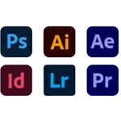

# Introduction

Hi, my name is Max and currently I'm attending San Diego College of Continuing Education to earn a skill in trade Informational Technology. I am studying HTML & CSS this summer.  I am trying to advanced my skills because I want to try a new field of work in my future.

## Online profile:

-  Hi, I’m @Docmillz91
-  I’m interested in learning how to code.
-  I’m looking foward to collaborating with colleagues this years.
-  The best way to get in contact with me is through [Github](https://github.com/Docmillz91) and [Linkedin](www.linkedin.com/in/docmillz)

  ## Certifications
  ### San Diego College of Continuing Education 
  #### 2023-2024

✨Digital Design (01-28-2023)

✨Video Production (05-25-2023)

✨Motion Graphics (05-25-2023)

✨Work Flow Managment for Web Design (05-25-2023)

✨Content Managment (06-10-2023)

✨Web Development Fundamentals (08-26-2023)

✨User Interface Design (10-23-2023)

✨Modern Web Development Tools (12-10-2023)

✨Front-End Web Development II (01-27-2024)

  

<!---
Docmillz91/Docmillz91 is a ✨ special ✨ repository because its `README.md` (this file) appears on your GitHub profile.
You can click the Preview link to take a look at your changes.
--->
